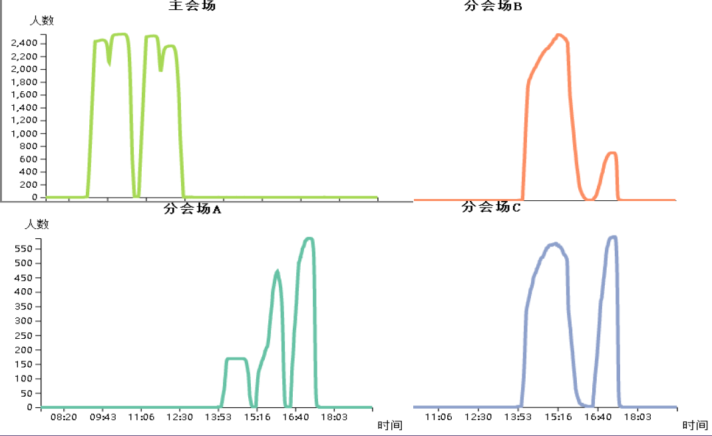

# **ChinaVis19-CICSC大会安全可视化与可视分析**

## **简介**  
    
赛题为2019年中国数据可视分析挑战赛的挑战1—— [ChinaVis2019 Challenge1](http://www.chinavis.org/2019/challenge.html) 。根据大赛提供的数据，利用 Python 的 Numpy 和  Pandas 数据分析库完成数据的处理，借助 `D3` 和 `ECharts` 两种可视分析框架，使用 Javascript 语言开发前端页面，以多种视图分析数据，展示数据分析结果。数据的取用和计算均由前端完成。本项目能在一定程度上帮助会场管理人员发现异常事件、优化会场资源配置。

## **本地运行方式**

在当前目录打开 powershell 窗口，输入 `python -m http.server` 启动本地服务器，使用 Chrome 浏览器，在地址栏输入`http://localhost:8000` ，打开目录栏中的 `home.html` 文件。  

## **背景**
CICSC (China Intelligence Cyber Security Conference)（虚构）是一个为期三天的智能网络安全领域的全国性学术大会，包括学术研讨、成果展览、黑客大赛三大组成部分，设置数据安全、物联网安全、移动安全、隐私保护、智能场馆、及智能安全技术创新六大研讨主题。会议期间有多位资深专家和商业大咖带来精彩的主旨报告、经验分享与成果展示，同时还邀请了许多参展单位和媒体记者，参会人员规模在5000人左右。

为了加强会场管理，也为了呼应“智能场馆安全运营”的会议主题，本次会议采用了无线传感器技术获取参会人员的实时位置信息。参会人员在进入会场时需要佩戴电子胸牌，胸牌内置信号发射器并绑定其个人信息。会场内布置的无线传感器可以实时接收并记录其覆盖范围内的信号发射器发出的信号。采集的传感器数据可用于实时检测会场人群分布情况，便于会场管理人员及时合理地调动资源，处理各种突发状况，为会议各项议题的顺利进行保驾护航。本组的任务是设计并实现一套数据可视分析解决方案，负责分析这些传感器数据，协助组委会管理会场，响应和处理各类应急事件。 

本次比赛提供两份数据，一是场馆内部的传感器分布数据，记录了传感器在场馆内布置的具体位置；二是传感器日志数据，记录了会议期间每个传感器收集的参会人员移动信息。 
 
会场和传感器布置图（灰色区域即为不含传感器的区域）:

## **可视方案总览**  

 前端页面截图：

## **方案设计**

* 会场全局监测
  * 主要场馆人数及人员密度实时监测。通过绘制会场实时人数统计条形图，实时展示主会场、分会场和展厅的人数和人员密度变化情况。该图与会场人员流动平面图共享时间选择和播放按钮。
  * 各场馆全天人数变化情况。通过绘制各场馆全天人数变化情况折线图，展示各场馆人数随时间变化的情况。该图可与会场人员流动平面图进行联动，点击平面流动图的场馆矩形区域，该图动态对应绘制该区域的折线，并更新其标题，不同场馆采用不同的折线颜色。
  
* 人员流动实时展示
  * 会场人员流动实况。通过绘制会场人员流动平面图，全局展示会场人员流动情况，用红色的圆圈代表参会者。提供时间选择功能，步长为30秒，时间下拉菜单和时间滑动条同步；提供可控制播放的“Play”和“Stop”按钮，决定是否自动推进时间进行播放。该图与会场实时人数统计条形图、各场馆全天人数变化情况折线图和各区域实时人数3D柱形图均可形成联动。
  * 各区域实时人数检测。绘制各区域实时人数3D柱形图，可反映热力特征，即人数越多颜色越接近暖色调；提供悬浮框交互，查看某位置具体人数；提供利用鼠标进行图的缩放和旋转功能；提供楼层选择功能。

* 人员类型分析模块
  * 人员分类情况展示。根据人员移动特征将人员分为七个类型，利用饼图绘制类型分布情况，各个扇形提供交互功能，可选择对应的类型，与个人活动区域堆叠条形图进行联动。
  * 个人活动区域展示。根据传感器日志表对每个id绘制个人活动区域堆叠条形图，展示各参会人员在时序上的区域移动情况。该图可选择特定类型进行显示，提供翻页和id搜索功能。
  * 个人轨迹显示。对每个参会人员分别绘制单人2D轨迹图和单人时序（三维）轨迹图，与个人活动区域堆叠条形图中的id按钮进行联动，点击后以弹窗形式展示。单人时序（三维）轨迹图z轴为时间，矩形高度代表时间的早晚，该图提供放缩和旋转功能。

## **分析结果**

* 会场日程安排推测。
  * 根据各场馆全天人数变化折线图进行推断，通过观察不同时间会场内人数的升降，可以推测各会场开始、中场休息以及结束的时间，得知会场日程安排。
   
  各会场日程安排推测：
      

* room功能推测。
  * 结合人员流动平面图和场馆全天人数变化折线图，分会场和主会场中场休息时，大量参会者涌入room1和room3，推测room1和room3均为茶歇点；乘坐VIP专用扶梯的嘉宾在中场休息期间进入room2，其余参会者不进入该房间，推测room2为VIP休息室；room4中大部分人员长期待在房内，推测为进行文案编辑的记者，因此room4为媒体间；room6人员进场不用签到，且入场较早，推测其为工作间；room5内的人员活动时间较为统一，符合比赛的特点，推测其为黑客大赛区。

* 人员类型分析和移动规律归纳。
  * 根据人员活动区域堆叠条形图进行推断，将人员分为七类。走VIP通道和VIP扶梯的人员为VIP嘉宾，长期待在媒体间的人员为媒体记者；进入黑客大赛区的人员为黑客大赛参赛者，进入会场较早的人员为工作人员，出席晚宴的人员为参展单位，剩余人员为普通嘉宾。  
  

* 会场异常事件捕捉
  * 人员拥堵：结合会场人员流动平面图和各区域实时人数3D柱状图，发现主会场、分会场散会期间，出口处以及茶歇间、厕所附近出现严重拥堵现象；第二天下午14:00-16:15 分会场B 区域人数爆满；第三天上午9:30-11:30 分会场B 区域人数爆满；第三天上午10:30-11:30 分会场A 区域人数爆满；第二天13:00-14:30 期间大规模人群向签售会区域聚集。
  

  * 轨迹异常：结合单人2D轨迹图和单人时空轨迹图发现，两个持有相同id（16632）胸牌的人同时在会场中移动，轨迹在两人之间来回跳跃。推测有人违规复制胸牌。
  

  * 工作人员迟到：通过人员活动区域堆叠条形图发现，第一天，id 为18347、10345、14859 的工作人员在10:30-11:30 入场，第二天，id 为18059、12856、11396、14678、10762、17576 的工作人员在10:30-11:30 入场。以上均为迟到现象。  
  

  * 人员越权：结合人员活动区域堆叠条形图和单人2D轨迹图发现，会议第一天分别有两名记者越权进入VIP 休息室采访。分别为id 为11201 的媒体记者D 和id 16473 的媒体记者E，他们分别在9:00-9:20 和10:30-10:50 期间进入VIP 休息室采访；会议第二天，id:13344 的VIP 类型人员F 在12:29:04-12:39:50 期间进入媒体间。
  * 黑客大赛提前离场：通过黑客大赛区人数变化折线图可以看出，黑客大赛参赛者离开黑客大赛会场的时间呈阶段式。

## **结论**

本次会议主办方在会议的组织和管理方面均存在一定的不足，包括基础服务设施配备不足、会场人员管理不足、会场设备维护不足、工作人员管理不足等。本大会安全可视化分析系统可为主办方监控会场情况，发现会场中出现的问题以及优化会议组织管理方案提供帮助和建议。

